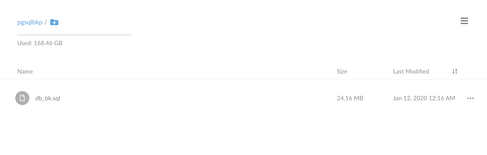

title: 备份 Postgresql 之 S3 篇
date: 2020-01-11 18:54:02
---


数据库备份的重要性不言而喻，这里介绍一下 Postgresql 是如何通过 S3 来备份的

# Postgres 备份
`Postgres` 数据库备份有两种大的方式，一种是物理备份，一种是逻辑备份

## 物理备份
物理备份不是说把整个物理硬盘备份，指的是文件系统层面的备份，简单来说就是 pg 在文件系统是怎么存的，老老实实复制一遍出出来，配合 WAL 日志事件，这样的备份方法可以做到持续不断的备份，并且可以做到恢复到任何一个时间点。（PITR point-in-time recovery）
物理备份的优点有很多，也是在生产环境运维上推荐的做法。下面看看优缺点

| 优点  | 缺点 |
|---|---|
| No locking - physical backups do not cause lock contention and do not depend on other connections releasing their locks |  High I/O pressure - copying the entire data directory may put significant pressure on your storage, but this doesn't have to necessarily apply if you're able to use some sort of filesystem-level snapshotting |
| Entire instance backed up - there's no need to restore single databases - one restore process is enough for an entire cluster  |  Entire instance backed up - there's no way to restore single databases or single tables, one has to restore all or nothing |
| Almost instantaneous restore process - no need to execute SQL statements to get data back | Very large base backups - physical backups include all the indices and bloat and may therefore be much, much larger than SQL dumps |
| PITR capabilities - the ability to go back in time | Need to archive WAL segments - you need to provide additional storage for binary log files |
| Just works - you just run postgres with the backed up directory and it does the job | Binary format - having backup in binary files means you are limited to restoring it using exactly the same PostgreSQL version it was created with |

## 逻辑备份
逻辑备份其实我们常用的 dump，简单高效快捷，但是缺点也非常明显，dump 的过程会对数据加锁，而且恢复效率低，并且需要额外的处理工作，例如角色等。

| 优点 | 缺点 |
|-------|-------|
| Less data to copy - logical backups do not copy all data files, so they may impose a lower I/O pressure on the system than physical backups | Locking - logical backups are both prone to and cause lock waits |
| Single database objects can be backed up - it's easy to backup and restore even a single table | |
| Smaller backup files - SQL dumps do not contain index data or bloat, so they are much smaller than physical backups | Long restoration process - SQL statements have to be executed to get schema and data back |
| No need for storing extra files - backups are self-contained | No PITR capabilities - a SQL dump can serve only as a snapshot of the data at the time it was created |
| Cross-version compatibility - SQL dumps are not dependant on restoring with the same version as was used to create them | Extra effort required - care has to be taken to back up global objects and to tune the server to allow for faster restoration etc. |

下文会使用逻辑备份演示备份过程

# 备份
这边演示的 pg 数据库安装在一台 `ubuntu` 的虚拟机上，中规中矩的安装

首先我们备份操作的用户要用 `postgres` ，比较方便 dump 出来而不用密码，我们直接 `su - postgres`，进去之后目录在 `/var/lib/postgresql`。

我们直接用 pg_dumpall 把所有数据库和角色都 dump 出来，命令很简单

``` shell
pg_dumpall > backup/db_bk.sql 
```

可以看到 ~backup~ 这个目录下已经有文件被 dump 出来了
``` shell
postgres@localhost:~$ ls backup
db_bk.sql 
```
> 真正的生产环境还是建议使用物理备份

# s3 同步
s3 的镜像功能十分适合存放备份数据，怎么存其实玩法很多，这里使用最简单的同步功能

这边没有亚马逊的 s3 服务，所以选择搭建兼容 s3 的 minio，使用 docker 搭建起来非常简单


- [minio安装教程](https://docs.min.io/docs/minio-quickstart-guide.html)
- [https://docs.min.io/docs/store-postgresql-backups-in-minio.html](https://docs.min.io/docs/store-postgresql-backups-in-minio.html)

根据上面的官方教程，搭建好 minio 服务，并在 db 服务器上安装好 mc，并配置好 minio 服务器后，就可以开始同步了 
``` bash
/mc mirror --force --remove --watch  backup/ minio/pgsqlbkp
```

到这里，我们已经可以在 minio 的网页客户端中看到我们的备份文件


## 让 mc 工作在后台工作
直接在命令行执行 mirror 操作会 attend 到当前的会话中，如果连接断开了，同步就会关闭了，所以我们需要让这个命令在后台运行

方法有很多，`service`，`nohub`, `supervisor`，等都可以，不过这里我简单用 `screen`，这样做最简单快捷，不过需要注意 screen 的日志会相对来说比较大，生产环境一般不推荐使用。


# 加密
数据库的数据是十分敏感的，在备份中，我们还是要做好加密工作，我们可以直接使用 openssl 进行加密解密

## 生成公私密钥
``` shell
openssl req -x509 -nodes -days 1000000 -newkey rsa:4096 -keyout backup_key.pem -out backup_key.pem.pub
```
接下来会在命令行问一些地理信息，填好之后就会生成好 `backup_key.pem` 和 `backup_key.pem.pub` 这两个文件了

> 也可以指定 -subj 参数，那样就不用在命令行进行交互输入

## 加密

我们把 `backup_key.pem.pub` 放到数据库服务器的 `/var/lib/postgresql/backup_key.pem.pub`，私钥留在自己的电脑上进行解密

然后我们就可以把 `pg_dumpall` 出来的结果通过管道进行 openssl 的加密

``` shell
pg_dumpall | openssl smime -encrypt -aes256 -binary -outform DEM -out backup/db_bk.encrypt.sql /var/lib/postgresql/backup_key.pem.pub
```

``` bash
postgres@localhost:~$ pg_dumpall | openssl smime -encrypt -aes256 -binary -outform DEM -out backup/db_bk.encrypt.sql /var/lib/postgresql/backup_key.pem.pub
postgres@localhost:~$ ls backup
db_bk.encrypt.sql
```

## 解密
把加密生成的 `db_bk.encrypt.sql` 通过 minio 下载到 Mac 上（当然也可以通过其他传输方式）

然后通过 openssl 进行解密

``` bash
openssl smime -decrypt -in ~/Downloads/db_bk.encrypt.sql -binary -inform DEM -inkey ~/Downloads/backup_key.pem -out ~/Downloads/db_bk.sql
```

解密成功，生成 `db_bk.sql`

最后打开 `db_bk.sql` 看一下，看到明文的 sql 语句，那么整个加密解密过程就成功了 

# 完善整个流程

## 每日备份的时候不覆盖
通过 bash 的 `$(date +"%d-%m-%y")` 取到 yyyy-MM-DD 的日期字符串，加到备份语句中，这样如果每年进行备份的话，之前的不会被覆盖
``` bash
echo -e "\nStart Time: $(date)\n" >> $backup_dir/Status.log
DEM -out backup/db_bk_$(date +"%d-%m-%y").encrypt.sql /var/lib/postgresql/backup_key.pem.pub
``` 

## 删除大于7天的备份
当然我们不希望备份文件无止尽的增长，不然很快硬盘就会被塞满了，通过 find 命令找到 7 天前的备份文件，然后删掉
``` bash
retention_duration=7
find backup/db_bk_* -type d -mtime +$retention_duration -exec rm -rv {} \;
```

## 脚本

最后的脚本如下：
``` bash
backup_dir=/var/lib/postgresql/backup/
touch $backup_dir/Status.log
echo -e "-------------------------------" >> $backup_dir/Status.log
echo -e "\nBackup Status:" >> $backup_dir/Status.log
echo -e "\nStart Time: $(date)\n" >> $backup_dir/Status.log
pg_dumpall | openssl smime -encrypt -aes256 -binary -outform DEM -out $backup_dir/db_bk_$(date +"%d-%m-%y").encrypt.sql /var/lib/postgresql/backup_key.pem.pub
echo -e "End Time: $(date)\n" >> $backup_dir/Status.log

#Auto Deletion for Backups
#Value 7 for retention_duration will keep 8 days backups

retention_duration=7
find $backup_dir/db_bk_* -type d -mtime +$retention_duration -exec rm -rv {} \;
```

## Crontab
最后，我们肯定需要设计一个 cron 定时任务，让每天都触发一次备份

```
EDITOR=vim crontab -e
```

设置每天凌晨3点钟进行一次备份脚本

```
00 19 * * * /var/lib/postgresql/backup.sh
```

> 中国时间凌晨3点等于UTC时间19点


到这里，整条备份流程已经可以运行了


## 参考
> 
- https://www.compose.com/articles/postgresql-backups-and-everything-you-need-to-know/
- https://cloud.tencent.com/developer/article/1127618
- https://www.linode.com/docs/databases/postgresql/how-to-back-up-your-postgresql-database/