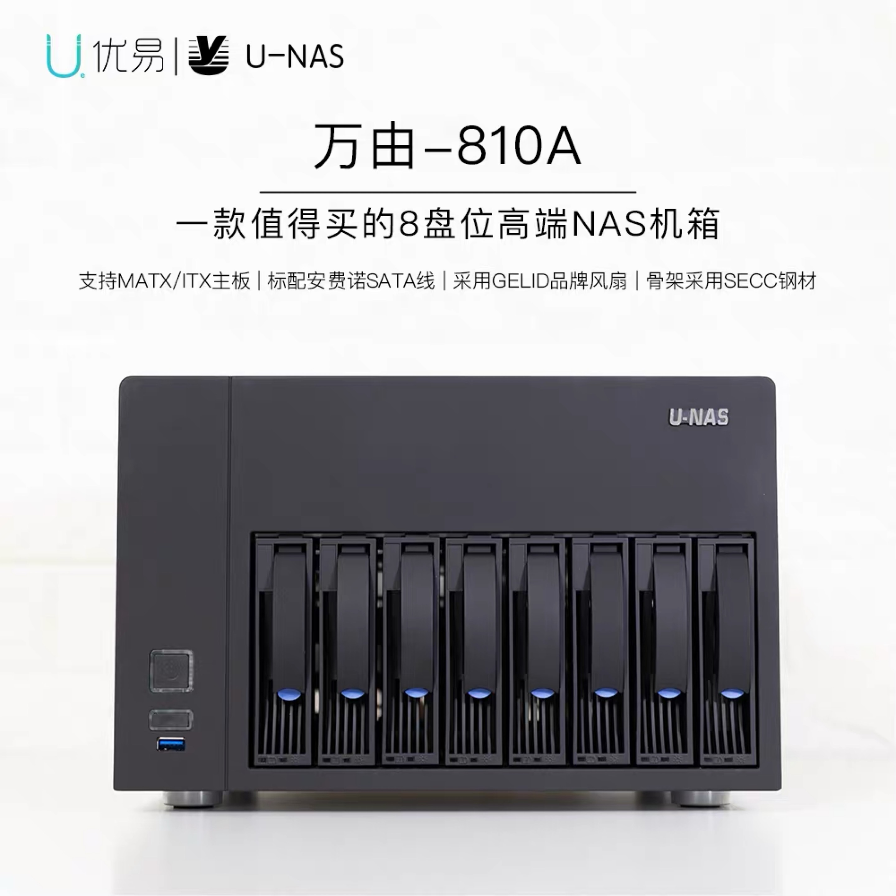
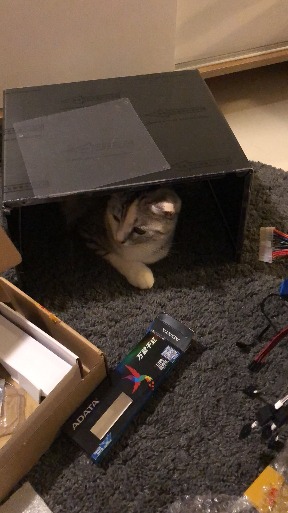
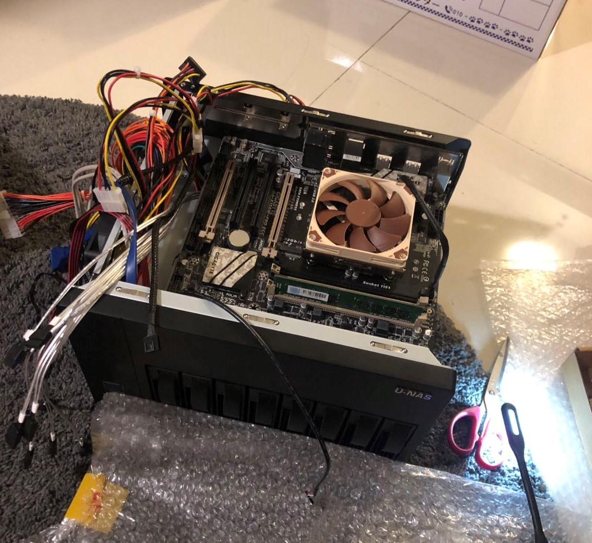
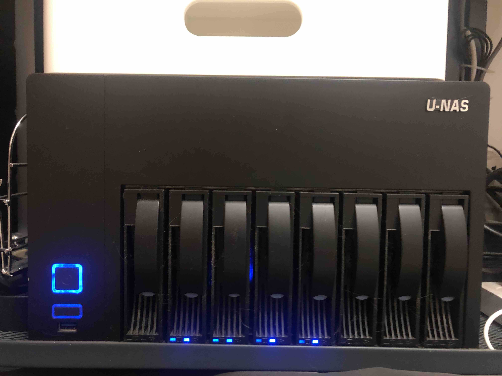
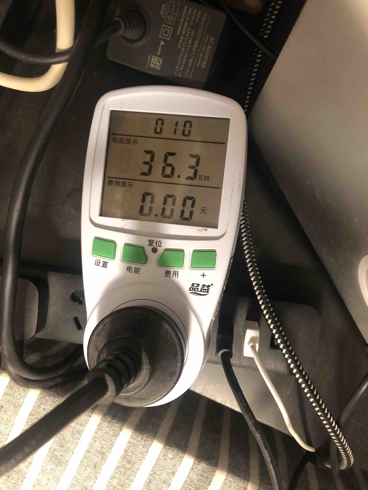
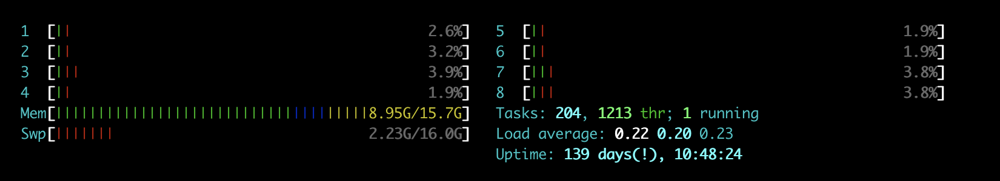

title: 打造一台家用高性能NAS
date: 2020-05-22 13:31:26
---

# 打造一台家用高性能NAS

之前买了一台入门级 NAS 铁威马 F2-220，然后发现 NAS 放在家里可玩性很高，开始 NAS 折腾之路了，不过很快就发现了，铁威马的系统限制很多，Docker 也玩不欢快，很快就萌生了换一台 NAS 的念头，家用 NAS 当然也就是群晖最有有名了，不过群晖的价格也摆在那里，而且大半万的价格，处理器的性能也一言难尽，跟我想象中家庭服务器的性能差太多，所以我想着，还是自己组一台算了。

## 硬件清单
首先是选择 CPU，定位是家用 NAS 加家用服务器，所以性能肯定不要差，主流的 j3455 主板方案虽然性能还过得去，但是最后还是算了，cpu 性能还是差太大。然后 NAS 由于要在家里二十四小时运行，功耗是很需要看重的一个点，桌面 CPU 动辄上80瓦的功耗肯定不能考虑，不然一年的电费都能上云了，所以我最后选择了至强 E3V5，也是所谓的洋垃圾，不过好在性能足够强，TDP 也只有 25W，可以说当下 DIY NAS 最佳选择了。

不过这垃圾在淘宝可不便宜，也花了645软妹币

然后是机箱，我算是个外观党，星际蜗牛我之前也有一台，外观不太好看我不太喜欢，淘宝上 NAS 机箱选择也不多，索性一步到位买了一个8盘位的万由，价格也很美丽，1450软妹币

贵是贵了点，但是还算大方好看

接下来，机箱和 CPU 确定了，主板的选择也不多了，至强只能选择 x150主板，于是在咸鱼上淘了一块技嘉X150M-PRO ECC，不贵，两百多，然后受机箱限制，风扇限高 5cm，CPU 风扇也只能奢侈一把，直接上了猫扇，不过后来事实证明，猫扇真的不亏，机箱十分安静

最后附上硬件清单:
- **机箱** 万由 NSC-810A (sata) 
- **机箱风扇**: GELID PWM 12cm x 2
- **CPU** E31240LV5 
- **CPU风扇** 猫头鹰 NH-L9i
- **主板** 技嘉X150M-PRO ECC
- **内存** 威刚万紫千红8G 2133hz x2 
- **电源🔌** 海韵 (ss350meu) 定制版
- **SSD** 金士顿SSD128G
- **HDD** 水货西数红盘x4

> 这个主板参数上是可以上硬RAID的，但是我在BIOS上研究了半天没研究出来，最后组了软RAID10

## 系统
使用 OpenMediaVault。官网: https://www.openmediavault.org/。

为什么不用黑群晖，首先我不喜欢用破解软件，网络安全也得不到保障，其次群晖我也用过，上面的大多数功能对我来说用处也不大，加上 OMV 用的 Debian 的系统，当服务器玩也能玩的欢快些。

不过需要注意的是，OMV 跟群晖系统比，简直差了一个宇宙，OMV 系统基本没有功能，除了安装后上去设置一下之外，也基本不会用到 OMV 系统的功能，读者在参考的时候一定要注意。

## 安装
实不相瞒，这次也是我第一次装硬件系统，不过实际操作起来却比想象中简单的多，上B站看看装机教程，然后安装过程中不要过多使用蛮力，基本不会有什么问题

下面附上两张装机图

在装机的时候发现了硬件准备上的一个致命的漏洞，那就是主板和 CPU 都不支持显示输出，也没内置显卡，没法装系统，盲装的话又太麻烦，无奈，只能在咸鱼上买了一个50块的垃圾显卡，装上之后，再把系统装上，然后把显卡拆掉

完成图：

风扇声音很小，十分安静

加上4块硬盘功耗在30瓦到40瓦之间，大概是硬盘智能休眠的时候，功率会下探到20多瓦

## 最后
刚装上之后体验了一下，组了软 RAID10 之后，HDD 速度也很块，系统性能也很不错。

事实上，写这篇文章时候这台 NAS 已经运行了大半年了，很稳定，没有发生过任何问题，上面运行了 Confluence，Jira，Jenkins，Seafile 等，都运行良好。

