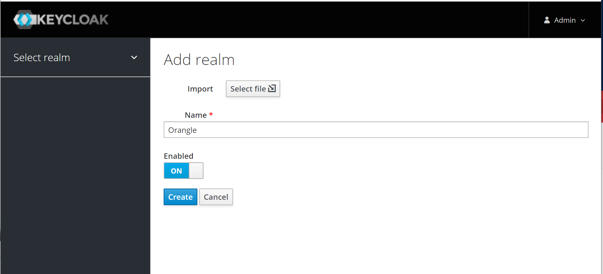

title: Spring Keyclock
date: 2020-04-22
 13:31:26
---

# OIDC

// TODO OIDC

这篇文章介绍一下，如何搭建一个基于 Spring Gateway 的 Oauth2 Gateway Demo

首先我们需要了解这个 Demo 需要的组件，分别是
- OAuth2 Server，这个我们选用的是 KeyCloak
- Api Gateway & OAuth2 Client，使用 Spring Gateway 作为 OAuth2 的客户端
- Resource Server (RS)，就是在 Api Gateway 后面隐藏的资源服务

整体的架构可以看下图


> 图片出自 https://spring.io/blog/2019/08/16/securing-services-with-spring-cloud-gateway

认证流程是，客户端（浏览器）访问应用，此时没有认证状态，然后重定向到单点登录平台，也就是 KeyCloak，然后在 KeyCloak 上进行用户名密码认证，或者是其他认证，成功后，KeyCloak 返回认证后的信息，然后客户端（Gateway）通过这些信息，再生成一个 Token，传到被保护的 Resouce Server，Resouce Server 拿到这个 Token 再向 KeyCloak 进行权限的认证，如果认证都通过，则允许对资源进行操作

# Api Gateway 搭建

第一步我们可以先进行 Api Gateway 的搭建，然后再回过头来设置 KeyCloak

我们假设这个 Demo 应用的名字为 orange

然后我们要搭建 api gateway，使用 https://start.spring.io 来生成项目，十分方便


我们勾选了 Gateway 和 OAuth2 Client 这两个依赖，然后下载下来，在 IDE 中打开，尝试运行一下，成功的话应该会在 8080 端口运行。

# KeyCloak 搭建

搭建一个 KeyCloak demo 也是十分简单，可以直接从官方网站上下载 java 包，然后通过命令也是可以一键运行，不过这里还是推荐使用 Docker 来运行，十分方便和干净

这里给出 Docker KeyCloak 容器启动命名，我们把端口映射到 6180

``` bash
docker run -p 6180:8080 -e KEYCLOAK_USER=admin -e KEYCLOAK_PASSWORD=123456 -d jboss/keycloak
```

> 这个 Admin 密码设成 123456，在正式一点的环境肯定也是不行的，不过我们是 Demo，就不需要管那么多了

然后创建一个 Realm



然后创建一个客户端 Client


接着创建一个用户


# 参考资料
- [Securing Services with Spring Cloud Gateway](https://spring.io/blog/2019/08/16/securing-services-with-spring-cloud-gateway)
- [An OAuth 2.0 introduction for beginners](https://itnext.io/an-oauth-2-0-introduction-for-beginners-6e386b19f7a9)