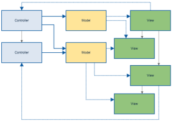

title: 为什么要做状态管理
date: 2019-10-04 17:26:54
---

# 为什么要做状态管理
在如今的前端开发领域，状态管理可能是最容易被误解的技术之一，也是滥用比较多的一门技术，很多开发者一上来就使用脚手架构建一套 `Vue` 全家桶，或者是 `React Redux/Mobx`全家桶，然后在一些简单的展示页面上也使用 `Redux` 之类的状态管理库，事实上是这并不是最佳实践。

## 状态管理是什么

近年来，随着单页面应用的兴起，`JavaScript` 需要管理比任何时候都要多的**状态**，或者可以说是数据，这些**状态**可能包括服务器响应、缓存数据、本地生成尚未持久化到服务器的数据，也包括 UI 状态，如激活的路由，被选中的标签，是否显示加载动效或者分页器等等，这些都是十年前二十年前的 web 开发没有遇到的挑战。

但是其实，无论系统如何复杂，前端页面的所要完成的事其实很简单，**就是把业务的信息渲染出来，反馈给用户，并进行人机交互，返回给服务端，这是前端技术解决的核心问题**。而几乎所有的 web 系统都不会把用户的一些数据和系统的状态维护在客户端，例如不会把用户的会员等级，新增的待办事项仅仅保存在浏览器，因为这些都是“转瞬即逝”的东西，用户换一个浏览器这些信息就会全部消失不见，所以这些数据（状态）必然会在服务器上存储起来，当用户重新登录的时候，页面会从服务器中重新拿到最新的数据，把页面渲染出来。

自从 `Ajax` 的诞生，使得 Web 应用不用大量和频繁跟服务器通信，原本需要服务器返回整个页面的数据，现在也只需要通过 Ajax 传递少量的信息，剩下的东西由 `javascript` 自己操作页面，对页面的元素修修改改。因为不用刷新整个页面，这种 Ajax 应用用户体验非常好，给人非常快的感觉，而 `Javascript` 对页面上的操作的总总过程，其实就是页面 UI 跟 `Javascript` 变量的同步，也设计跟服务端数据的同步，**也就是我们所说的状态管理**。

### 广义状态管理
**状态管理是一个十分广泛的概念，因为状态无处不在。**服务端也有状态，`Spring` 等框架会管理状态，`RDS` 和 `redis` 等组件会保存数据，手机 `App` 也会把数据保存到手机内存里，状态管理不是什么新鲜事物，在 web 前端还没有变复杂之前，很多系统的网页用着纯 Javascript 或者 jQuery 来做一些状态管理，或者说是一些数据管理吧，当然，这里边要做的事情其实很复杂，主要表现在状态的同步上，可以看下面的一个例子。

#### javascript 无框架时代状态管理例子

``` javascript
addBook(book) {
  // js 状态逻辑
  this.books.push(book);
  
  // 同步服务器逻辑
  this.callAddBookApi(book).then(this.ajustUIBook);

  // UI 逻辑（同步）
  this.mayBeDoSomethingElse();

  const li = document.createElement('li');
  const span = document.createElement('span');
  span.innerText = book.name;

  this.$bookUl.appendChild(li);
  li.appendChild(span);
}
```

这里例子中，我们通过某个表单增加了一本书，`addBook` 这个方法先是在本地的 `books` 变量中加进去，然后请求服务器，把新增加的 `Book` 信息传过去，当然结果可能成功也可能失败，所以要调用一个回调方法进行调整，然后再操作 Dom 来更新页面的展示。当然，还有更复杂的情况，例如在页面别的地方，可能有所有 `Book` 的计数，或者有“用户最近的 `Books`”的展示，程序需要找到那些元素的 Dom，并用特定的领域逻辑对 Dom 内容进行更新。

> 事实上，在 2019 年的今天，我在很多手机 App 上还能看到相识的 Bug，例如我在闲鱼上看到一条应用内消息，但是到消息页面查看，对应联系人消息框中却没有看到，要刷新一下才会显示，这应该是典型没做好状态管理的例子。

这样的问题在大型的 web 应用中会变得非常复杂，Facebook 的 web 应用就深受这样的问题的困扰。

### *Facebook 遇到的问题*

Facebook 的站点是最早开始 Web App 这个概念的一批，在 Facebook 没有创造出 Flux 这种架构之前，Facebook 就有很多状态未同步的 bug，我在曾经很少使用的几次经历中，也目睹过这些 bug，就是当在 Facebook 逛着逛着，突然来了几条通知，但是点进去之后竟然没有了，过了一会儿，通知又来了，点进去看到了之前的消息，但是新的还是没有来。

虽然 Facebook 在的客户端结构跟流行的 MVC 架构或者 MVP 架构不一样，但是他们问题的原因大概就是在 [http://fluxxor.com/what-is-flux.html](http://fluxxor.com/what-is-flux.html) 描述的这样

> http://fluxxor.com/what-is-flux.html
>
> 为了最好地描述流量，我们将其与领先的客户端架构之一：MVC进行比较。在客户端MVC应用程序中，用户交互会触发控制器中的代码。控制器知道如何通过调用模型上的方法来协调对一个或多个模型的更改。当模型更改时，它们会通知一个或多个视图，这些视图又从模型中读取新数据并进行相应的更新，以便用户可以看到该新数据。
>
> 
>
> 一个简单的MVC流程
>
> 随着MVC应用程序的增长以及控制器，模型和视图的添加，依赖性变得越来越复杂。
>
> 
> 
>
> 仅添加三个视图，一个控制器和一个模型，就已经很难跟踪依赖图。当用户与UI交互时，将执行多个分支代码路径，并且在弄清楚这些潜在代码路径中的一个（或多个）中的哪个模块（或多个模块）包含错误的情况下，在应用程序状态下进行调试成为一种练习。在最坏的情况下，用户交互将触发更新，进而触发其他更新，从而导致沿其中一些路径（有时是重叠的路径）的易于出错且难以调试的级联效应。
>
> Flux避开此设计，而采用单向数据流。视图中的所有用户交互都将调用操作创建者，这将导致从单例调度程序中发出操作事件。调度程序是通量应用程序中所有动作的单发射点。该操作从调度程序发送到存储，存储根据响应更新自身。

事实上，在同一时期，Facebook 的 `React` 跟 `Flux` 一起设计出来，光芒四射的 `React` 席卷了整个前端，同时在 `Flux` 的启发下，状态管理也正式走进了众多开发者的眼前，状态管理开始规范化地走进了人们的眼前。

### 现在的 web 状态管理（狭义状态管理）
现在的状态管理已经成为了前端开发技术栈的一个主题，工具库和框架都十分丰富。现在谈及状态管理，虽然概念还是很很宽泛，但是还是能收敛到几个点上。

1. 数据流的方向性管理，如 Flux
2. 系统状态的框架性工具管理，例如 Redux，Mobx
3. 组件生命周期内的状态管理，例如在 React 中使用 `setState` 或者 `hooks`
4. ...

事实上，现在前端开发谈及状态管理，其实就是指的是像 Redux 这样的东西，**用单一数据流的思想指导整个系统，并把状态存储到特定的地方，在 UI 组件层通过一些选择器把需要组件取出，渲染到 UI 上。**

状态管理的工具库并不仅仅有 `Redux`，像 `Mobx`，`Vuex` 等，都是十分优秀的库，思想也大抵相似。

当然，我也见过有不少应用并没有使用状态管理库，而是自己手写一套状态管理方案（事实上， 这个事情完全不困难，因为像 `Redux` 这样的库，实际上十分的简单，早期的 `Redux` 代码库只有一两百行代码）。例如像 `Angular` 技术栈，有人会通过 `Angular Service` 这个载体，利用 `Rxjs` 做简单的状态管理，也有亮点；也例如 React，也有人直接通过单例对象或者 `hook` 来连接一个自定义状态管理服务，这些个做法不论在大在小的项目，都有自己的玩法。**状态管理设计这个事情并不需要囿于框架和工具库，甚至在工具库中也可以有自己的玩法。**

虽然说状态管理的定义事实上很广泛，也有很多优秀实践，但是做好状态管理还是要遵循一些原则。

### **1.UI分层**
在后端开发中，领域驱动设计（DDD）要求把业务模型隔离开来，做到跟基础设施无关，无侵入，并用 Adaptor 隔离网络，数据库等操作，一个美好的假设是，假如以后做的重构，或者更换 web 框架，那么只需要更换架构外层的 Adaptor 即可，领域层无需改动。

这个道理放到前端也是适用的，不过现在的前端是组件驱动的时代，前端的核心领域是 UI 层，**好的状态管理应该做到 UI 层独立，并让状态管理的逻辑尽量少侵入到 UI 层。**，另一个说法是要保持 UI 层的纯度，只要相同的数据传到 UI 层，就应该是相同的表现，那么以后换一个状态管理方案，或者说一些 Api 层面的改动，再或者是引入了 `BFF`，减轻了前端逻辑的负担，那么这些改动只需要在状态管理的领域中完成即可，UI 层完全可以不用改动，这种做法大大减轻了前端开发的上下文负担，而且对单元测试十分友好。

> 有一些前端应用的逻辑也很重且复杂，又是另一回事了，除了 UI 层，也应该对那些核心逻辑进行建模和分层，维护双核心。不过，除了一些富应用（例如思维导图应用，drawio 一样的工具），我十分不建议在前端放过多的领域/业务逻辑。

### **2.单一数据源**和**单向数据流**
**单一数据源**和**单向数据流**是做好状态管理的关键，这能使应用从乱七八糟的状态中解救出来，单一数据源要求客户端应用的**关键**数据都要从同一个地方获取，而**单向数据流**要求应用内状态管理的参与者都要按照一条流向来获取数据和发出动作，不允许双向交换数据，如下图

> 
> 图片出自 http://fluxxor.com/what-is-flux.html

**单一数据源**和**单向数据流**这两个概念长得很像，也互有联系，**单一数据源**保证了 UI 渲染的单纯性，只需要对单一来源的数据做出响应，来什么样的数据就通过可以预测的数据来转换 UI，保证不会出错，这就好像“[手表定律](https://baike.baidu.com/item/%E6%89%8B%E8%A1%A8%E5%AE%9A%E5%BE%8B/4307956?fromtitle=%E6%89%8B%E8%A1%A8%E6%95%88%E5%BA%94&fromid=1789873)”一样，如果有两个上司指挥你，你就会不知所措。**单向数据流**通过限制数据和动作的流向令数据可以进行追溯，可以实现一些日志打印，热加载，时间旅行，同构应用等功能，另一个作用是在 UI 层对状态变更进行控制反转([Inversion of Control](http://fluxxor.com/what-is-flux.html#inversion-of-control))，从而实现解耦的目的。

举个Redux的例子，一个页面中渲染了数据列表 `books`，这个 books 变量是通过 store 获取的，符合单向数据流 但是这时候要添加一本书，我们调用了一个 api 请求 `createBook`，通常有人为了方便，会在组件里面调用异步的 Action 或者通过 http 调用请求后直接把新增的 `book` 加到列表里面。这是一个典型错误的做法，同时违法了单一数据源和单向数据流，这样的情况一多，意味着应用内的状态重新变成七零八落的情况，重归混沌，同步失效，bug从生。

> 这里要强调一下并不是把所有的变量都往单一数据流中的 `store` 里塞，一些**组件内的状态**应该在**组件内完成自己的生命周期**，例如一个 Selector 的 `isSelecting` 状态，又例如一个 Modal 的 `isOpen` 状态。

# 状态管理的好处及带来的问题。
最后，总结性地回到一下为什么要做状态管理

状态管理有以下的好处

1. 能有效分离 UI 层和数据处理层
2. 帮助前端应用结构化数据
3. 有效控制状态的变化
4. 处理同步与异步
5. 实现一些日志打印，热加载，时间旅行，同构应用等功能
6. ...

当然，状态管理也有缺点，其实就一点，**就是代码会变得更复杂**，当然，这一点并不完全是缺点，当一个应用业务用例和代码量不断上升的时候，代码不可能维持简单简洁，如果没有一个的好架构的约束，那么只会演变成大泥潭，但设计出一个好的状态管理方案，那么就可以把复杂度控制在一个合理的范围内。


## 参考文章 
- [https://zhuanlan.zhihu.com/p/20263396](https://zhuanlan.zhihu.com/p/20263396)
- [https://zhuanlan.zhihu.com/p/37090152](https://zhuanlan.zhihu.com/p/37090152)
- [https://www.redux.org.cn/docs/introduction/Motivation.html](https://www.redux.org.cn/docs/introduction/Motivation.html)

