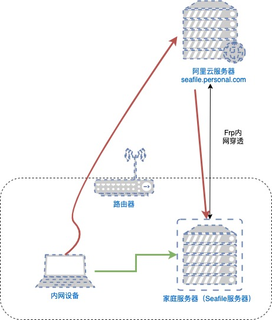
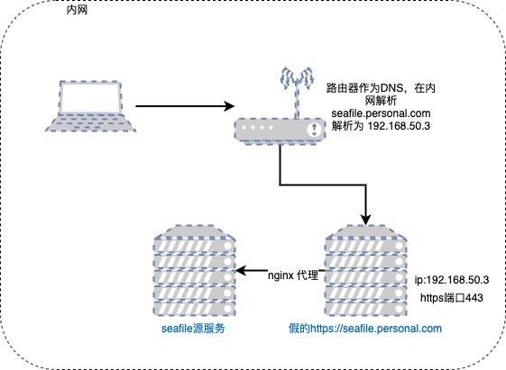
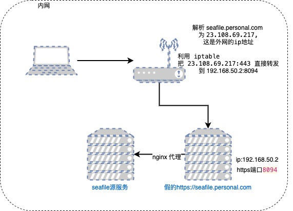
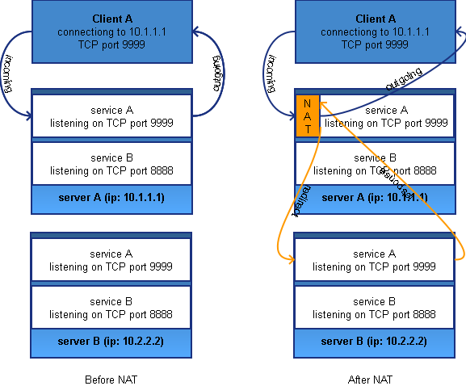
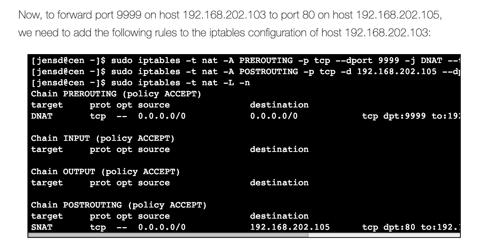

title: 如何在内网拦截内网穿透 Https 网站
date: 2019-03-04 16:26:54
---
# 如何在内网拦截内网穿透 Https 网站

## 为了解决什么问题

我在家里路由器的网络环境中搭建了一套 Seafile，但是没有公网 ip，也不能 DDNS，所以我用内网穿透把这个服务穿透到了我的一台阿里云 ECS 上，还配置了域名 seafile.personal.com （虚构），也上了 https，但是国内的 ECS 大家都懂的，水管非常小，我的只有 3M，在外面用其实也不慢，但是在家里用的话，还是这么慢，感觉划不来。



如上图，内网访问 seafile.personal.com 的时候，走的是红线，需要走出内网到阿里云服务器，而服务器还要访问内网的机器来代理服务，绕了一大圈，理论上就快不了。

所以我想用一种方法，就是在内网访问我的 Seafile 网站时，不用绕阿里云服务器了，直接访问内网的 Seafile 服务器，那样效率最高，如上图的绿色线一样。而且这样做的话，用户实际上没有任何感知，访问的都是 [https://seafile.personal.com](https://seafile.personal.com)，体验很好。**当然，如果没有 https 的话，直接在设备上配置 hosts 文件，就能直接绕过了。不过，要拦截 https 的网站，还是要下点功夫。**


> 这里不得不吐槽一下 Seafile，这一点跟 nextcloud 的设计还是差了一大截，seafile 需要设置服务域名，上传下载直接要用调用一个设置好的域名或者 ip 的 seahub 服务。而 nextcloud 允许配置多个可访问域名，就不用那么麻烦了。

## 思路
思路如图，路由器充当 DNS，令 DNS 解析 seafile.personal.com 域名的时候，解析成 192.168.50.3 ，这个 ip 地址是我们在内网部署的一个 nginx 服务，代理 seafile 源内网地址并开启了 https 进行监听




<span style="color:red">**但是!!**</span>

**在实施的时候，我没有另外的机器了，也就是说没有一台新机器充当 192.168.50.3，所以，我并没有用这种方案**，如下图所示，用 iptables 直接把 `23.108.69.217:443`（这是真的外网 seafile.personal.com 地址，不过是虚构的）直接转发到内网新部署的一个 https 端口即可，这个端口用真的 https 证书代理了内网的 seafile 服务，相当于暗度陈仓吧。



## 搭建代理 Nginx
思路有了，这样做我们访问 seafile.personal.com 的时候，实际上访问的是内网的一个 https 服务，那么我们需要在内网搭建 nginx 服务，然后启用 https，再把阿里云服务器上有效的 https 相关证书下载下来并配置，**其实就是相当于把阿里云的服务给搬下来而已**，这里不做过多的介绍，**这里假设我们启动的 https 服务地址端口是 192.168.50.2:8094**

## iptables 设置
接下来就是用 iptables 把 ip 和 port 都转发了，理论上来说，用 iptables 来实现这样的需求是可行的，就是把 ip1:port1 的流量全部转发到 ip2:port2 上

Google 了一下，发现下面这篇文章讲的非常系统

[http://jensd.be/343/linux/forward-a-tcp-port-to-another-ip-or-port-using-nat-with-iptables](http://jensd.be/343/linux/forward-a-tcp-port-to-another-ip-or-port-using-nat-with-iptables)

以下是文章里的用图





这要用到 `iptables` 的 NAT 表，大概意思就是跟我们平时路由器用的 NAT 技术一样，只不过这个 NAT 表在我们这里只用在了内网

NAT 技术讲的是子网的 ip 全部用一个 ip 转发，在内网的 ip 要跟外面的通信，其实是发到了出口的公用 ip 上，那么网络包中就要带着源头 ip 的信息和目标 ip 的信息，由网关来记住这个信息，因为这其实就是进出的两套规则，那么对应在 iptables 上就是 **PREROUTING** 和 **POSTROUTING** 这两套规则

根据文章上的教程




这边我的 seafile 服务 seafile.personal.com 这个域名的外网 ip 是 23.108.69.217(虚构)，而端口是443, 走的 https 加密

而 seafile **代理**服务在我家里内网的 ip 是 192.168.50.2，https 端口是 8094 *(这个服务就是刚才搭建的那个假的https seafile服务，并不是最源头那个)*

**那么要转化的 ip 和 port 就是  23.108.69.217:443  =>  192.168.50.2:8094**

`iptables` 的设置命令为：
``` bash
iptables -t nat -A PREROUTING -p tcp -d 23.108.69.217 --dport 443 -j DNAT --to-destination 192.168.50.2:8094

iptables -t nat -A POSTROUTING -p tcp -d  192.168.50.2 --dport 8094 -j SNAT --to-source 23.108.69.217
```

接下来，ssh 到路由器上执行即可

> 我的路由器是华硕的 AC86U，已经打开了 ip 转发的功能，如果是其它机型，可能还需要其它额外的操作

## 最后
一切操作完之后，这个也很难测试，直接打开了 seafile 上传一个大文件，速度达到 50M/s，这个不用说，就是成功了。

## 参考文章
- [Four ways to connect a docker container to a local network](http://blog.oddbit.com/2014/08/11/four-ways-to-connect-a-docker/)


