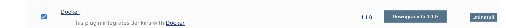
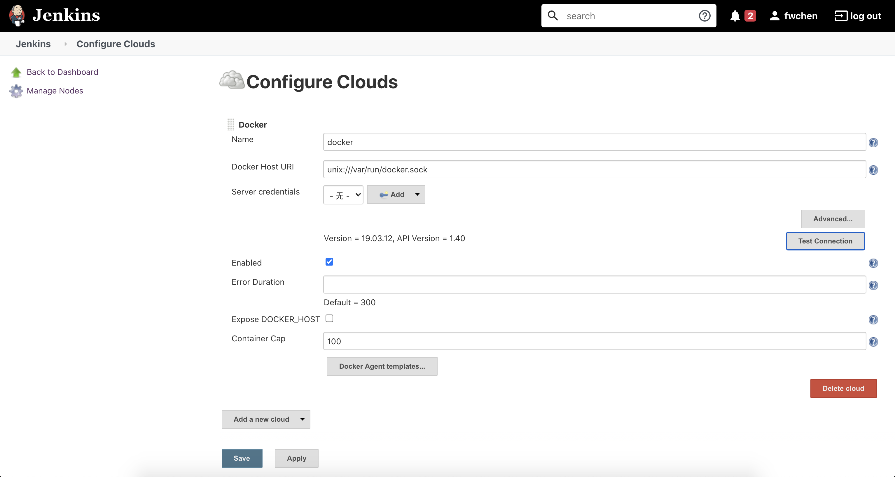
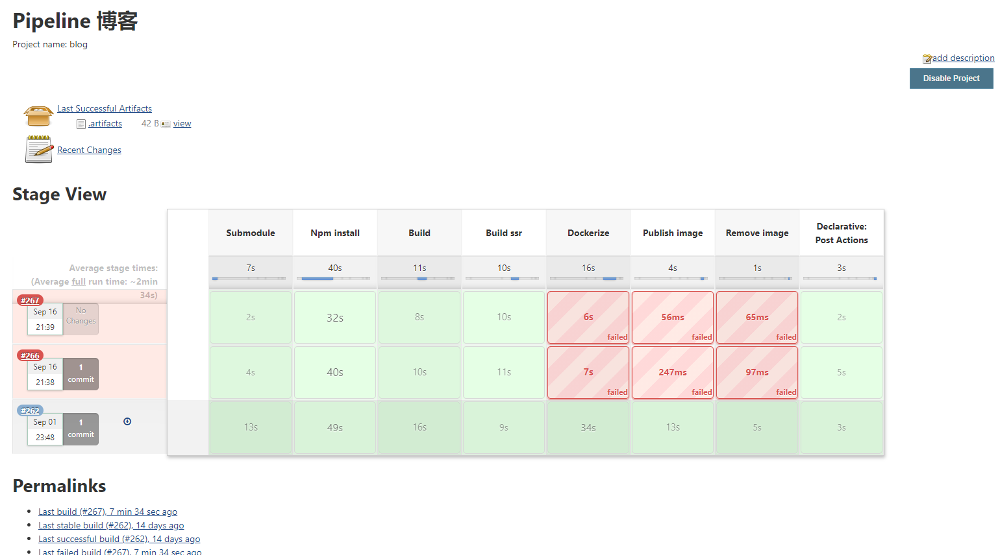

title: 如何使用Docker来部署持久的Jenkins服务
date: 2020-04-09 19:57:09
---

这篇文章分享一下如何用 Docker 来部署 Jenkins，还有如何在 Docker Jenkins 中使用 pipeline 配置项目


## 启动 Docker
首先需要启动 Docker jenkins，这一步十分简单，但是需要一些参数
``` bash
docker run -d -v jenkins_home:/var/jenkins_home -p 8012:8080 -v /var/run/docker.sock:/var/run/docker.sock --name jenkins -u 0 -e TZ="Asia/Shanghai" jenkins/jenkins:lts
```

- **-v jenkins_home:/var/jenkins_home** 是挂载本地空间目录，这个如果不挂载的话，重启 Docker 容器里面的数据就没了
- **-p 8012:8080** 映射端口到本地 8012
- **-u 0** 指定 Docker 容器以 root 用户运行（注意！：这样做十分不安全，因为我是在虚拟机上操作，所以用的 root 用户，这样也需要启动 root 用户的 docker。非 root 用户运行千万不要加这个参数）
- **-e TZ="Asia/Shanghai"** 指定时区环境变量
- **-v /var/run/docker.sock:/var/run/docker.sock** 挂载宿主 Docker 的 sock 文件

上面的启动参数，其中最重要的是最后的一个，就是把属主机的 docker sock文件挂载到 Docker Jenkins 里面，因为这样才能让在 Pipeline 中使用 Docker 来进行构建。

当然，有些极客朋友可能会说，那我直接在 Docker 中运行 Docker 也可以嘛，但是 Docker 中套 Docker 其实更难搞，而且有很多坑。

甚至 Docker 的一名贡献者也专门写过文章来
https://jpetazzo.github.io/2015/09/03/do-not-use-docker-in-docker-for-ci/


## 连接宿主机 docker
既然我们不会在 Jenkins Docker 容器中启动 Docker 服务，那么就只能通过 socket 的方式连接一个启动好的 Docker 服务，所以我们启动 Jenkins 容器的时候，我们把 docker socket 文件挂载在容器里，`-v /var/run/docker.sock:/var/run/docker.sock`。

首先我们要安装 `Docker` 插件



然后我们到 Jenkins setting > Configure Clouds 中设置，新建一个云配置，命名为 Docker, 然后填入 `unix:///var/run/docker.sock` 即可完成，如下图。




## 如何配置项目的 Pipeline
虽然运行在 Docker Jenkins 中的项目配置也大同小异，但是还是有一些地方需要注意下。

下面先帖一个真实的 Pipeline 例子。


``` jenkinsfile
pipeline {
    agent none
    triggers {
        pollSCM('*/1 * * * *')
    }
    environment {  # 设置一些环境变量，写入配置中的预设值，用来执行 Pipeline 时的构建用
        DOCKER_REGISTER = credentials('jenkins-blog-docker-register')
        HOME = '.'
    }
    stages {
        stage('Submodule') {
            agent {
                node {
                    label 'master'
                }
            }
            steps {
                sh 'git submodule update --init --recursive'
            }
        }
        stage('Npm install') {
            agent {
                docker {
                    image 'node:12.14.0-stretch'
                }
            }
            steps {
                sh 'npm install'
            }
        }
        stage('Build') {
            agent {
                docker {
                    image 'node:12.14.0-stretch'
                }
            }
            steps {
                sh './node_modules/.bin/starfish render . --output="blog-static"'
            }
        }
        stage('Build ssr') {
            agent {
                docker {
                    image 'node:12.14.0-stretch'
                }
            }
            steps {
                sh './node_modules/.bin/starfish angular-ssr .'
            }
        }
        stage('Dockerize') {
            agent {
                docker {
                    image 'docker:19.03.5'
                    args '-v /var/run/docker.sock:/var/run/docker.sock'
                }
            }
            steps {
                sh "docker build . -t $DOCKER_REGISTER/fangwei-blog:v0.0.$BUILD_NUMBER -t $DOCKER_REGISTER/fangwei-blog:latest"
            }
        }
        stage('Publish image') {
            agent {
                docker {
                    image 'docker:19.03.5'
                    args '-v /var/run/docker.sock:/var/run/docker.sock'
                }
            }
            steps {
                sh 'docker push $DOCKER_REGISTER/fangwei-blog:v0.0.$BUILD_NUMBER'
                sh 'docker push $DOCKER_REGISTER/fangwei-blog:latest'
                sh 'echo "$DOCKER_REGISTER/fangwei-blog:v0.0.$BUILD_NUMBER" > .artifacts'
                archiveArtifacts(artifacts: '.artifacts')
            }
        }
        stage('Remove image') {
            agent {
                docker {
                    image 'docker:19.03.5'
                    args '-v /var/run/docker.sock:/var/run/docker.sock'
                }
            }
            steps {
                sh "docker image rm $DOCKER_REGISTER/fangwei-blog:v0.0.$BUILD_NUMBER 2> /dev/null"
            }
        }
    }
    post {
        always {
            rocketSend currentBuild.currentResult
        }
    }
}
```

需要注意的是一点，如果需要在在 Docker Jenkins Pipeline 中运行构建的 Docker，例如构建测试，打包等，还是需要把 Docker 的套接字挂载到容器上。



## 安全问题

### Docker安全性
这种方案的弊端是把 Docker 暴露给了 Jenkins，并且是完全暴露，在一些特定的环境，宿主机的 Docker 甚至会有安全漏洞，