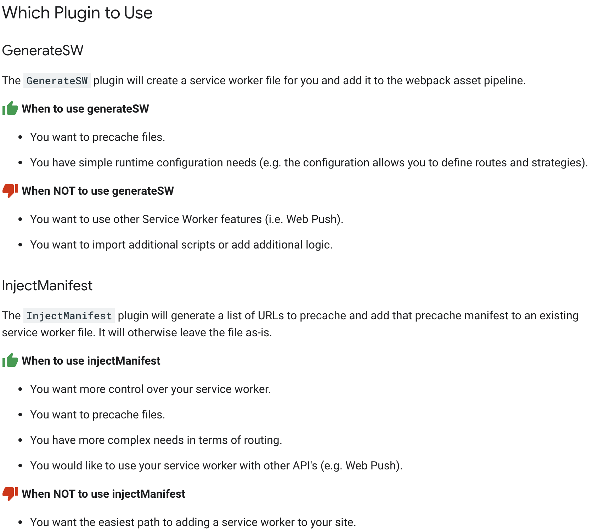

title: CRA如何集成Workbox进行离线缓存
date: 2020-10-25 13:26:54
---

相信大部分开发者在React的学习或者工作中都有使用过 CRA(Create React App)，这是一个十分优秀的脚手架，基本能满足绝大部分前端开发的需求，CRA 生成出来的 React 初始代码中有一个十分方便的功能，就是 PWA，这个功能会注册 Service Worker，开启离线缓存。但是因为 Service Worker 太特殊了，一旦注册在用户的浏览器，全站的请求都会被 Service Worker 控制，一不留神，小问题也成了大问题了。

## CRA中PWA的问题
CRA默认的 service worker 其实是自动生成的，`src/registerServiceWorker.js` 这个文件其实只是用来注册，注销 service worker 用的，真正生成的是 workbox 的插件，**[workbox-webpack-plugin](https://developers.google.com/web/tools/workbox/modules/workbox-webpack-plugin)**。

而这个 workbox-webpack-plugin 里面有两个插件

**一个是 GenerateSW，另一个是 InjectManifest**

在插件的官方页面上有描述这个两个插件的区别：



简单的来说，GenerateSW 就是最简单的实现方法，且不需要写代码，但能写一些配置，不能写其他 service worker 的功能。

而 Create Create App 的 webpack 脚本就是用的 GenerateSW。

GenerateSW 生成出来的 service-worker.js，只有 workbox CacheFirst 的能力，这意味着，整个页面是强缓存的，当部署了新的静态资源到服务器上，刷新页面并不会使得资源更新，必须要关闭了所有同域名下的 Tab 页面才会生效，并且也不会通知用户，只会在控制台打印下面的信息：

"New content is available; please refresh."

> 毕竟这是最简单的 cache 方案嘛


所以，相信这样的方法是满足不了大部分需求的，除非那真的是一个离线也能运行的很好的 web app，但如果真的想构建 offline app，CRA 的文档中也有很好的讨论，可以作为参考 [offline-first-considerations](https://create-react-app.dev/docs/making-a-progressive-web-app/#offline-first-considerations)

## InjectManifest

我们需要自己定义 service worker 来充分使用 workbox 的功能。而 CRA 的 react-scripts 都是封装好的脚本，所以我们需要使用 react-app-rewired 来加一个 `workbox-webpack-plugin` 插件

可以在 https://github.com/timarney/react-app-rewired 查看 react-app-rewired 项目。


``` bash
$ yarn add workbox-webpack-plugin 
$ yarn add react-app-rewired
```

然后在项目根目录下，新建 `config-overrides.js` 文件，来用进行配置 webpack，因为 service worker 不能在 local 环境运行，所以我们需要判断 enviroment 来进行追加 webpack 插件


`config-overrides.js`:
``` javascript
const path = require('path');
const { InjectManifest } = require('workbox-webpack-plugin');

function findSWPrecachePlugin(element) {
  return element.constructor.name === 'GenerateSW';
}

function removeSWPrecachePlugin(config) {
  const swPrecachePluginIndex = config.plugins.findIndex(findSWPrecachePlugin);
  if (swPrecachePluginIndex !== -1) {
    config.plugins.splice(swPrecachePluginIndex, 1); // mutates
  }
}

module.exports = function override(config, env) {
  if (env === 'production') {
    console.log('Production build - Adding Workbox for PWAs');
    removeSWPrecachePlugin(config);
    config.plugins.push(
      new InjectManifest({
        swSrc: path.join(__dirname, 'src', 'service-worker.js')
      })
    );
  }
  return config;
};
```

上面的 `swSrc: path.join(__dirname, 'src', 'service-worker.js')`，让 InjectManifest 插件来编译 `src/service-worker.js` 源代码，接下来我们新建此文件：


`service-worker.js`
``` javascript
import { CacheFirst } from 'workbox-strategies/CacheFirst';
import { NetworkFirst } from 'workbox-strategies/NetworkFirst';
import { precacheAndRoute } from 'workbox-precaching/precacheAndRoute';
import { registerRoute } from 'workbox-routing/registerRoute';

precacheAndRoute(self.__WB_MANIFEST);

registerRoute('/', new NetworkFirst());

registerRoute(
  '/static/',
  new CacheFirst({
    cacheName: 'static-cache',
    matchOptions: {
      ignoreVary: true
    }
  })
);

self.addEventListener('message', event => {
  if (event.data && event.data.type === 'SKIP_WAITING') {
    self.skipWaiting();
  }
});

self.addEventListener('install', event => event.waitUntil(self.skipWaiting()));
self.addEventListener('activate', event => event.waitUntil(self.clients.claim()));
```

 通过 workbox 配置，指定根路径 / 下的资源是 NetworkFirst 的，意味着这部分资源都是网络优先，有新的资源文件会先请求网络，而 /static/ 路径下，因为 CRA 打包出来都使用了 revving（文件带hash，确保新文件不会被缓存），所以设置为 Cache 优先。

 > revving: [Web/HTTP/Caching_FAQ#改进资源](https://developer.mozilla.org/zh-CN/docs/Web/HTTP/Caching_FAQ#%E6%94%B9%E8%BF%9B%E8%B5%84%E6%BA%90)


到这里，已经完成了 InjectManifest 的设置，但是别忘了要在 `index.js` 中打开 serviceWorker.register() 来注册 sw

```
import React from 'react';
import ReactDOM from 'react-dom';
import './index.css';
import App from './App';
import * as serviceWorker from './serviceWorker';
ReactDOM.render(<App />, document.getElementById('root'));

// serviceWorker.unregister();
serviceWorker.register();
```
