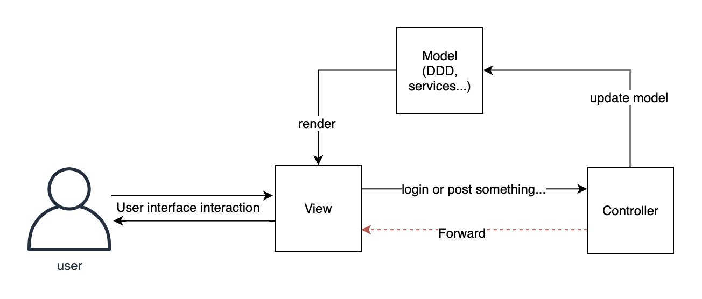
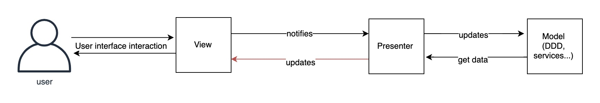
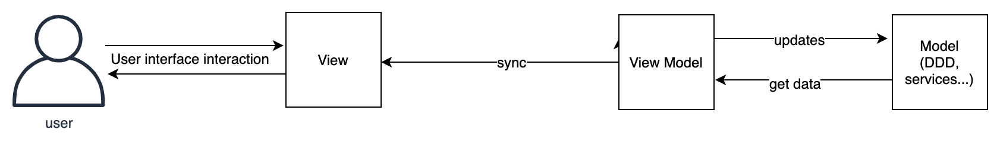

title: Http缓存介绍
date: 2020-02-23 17:26:54
---

# 谈谈 Web 前端 MVC, MVP， MVVM 和 FLUX 设计模式

MVC，MVP，MVVM一直都是 GUI 领域常见的设计模式，这三个每个都在各自独特的领域独占一方。例如 MVC 一直都是一些后端应用框架标榜的设计模式，而安卓应用开发更多在使用 MVP 设计模式，而 MVVM 的思想或者 MVVM 的变体一直活跃在现在 Web 前端开发框架中。

# 什么是 Model（模型）
Model 是好几个概念中非常重要的一个概念，在介绍四种设计模式之前，什么是 Model 模型，这里要先介绍一下。

模型 Model 可以理解成很多东西，甚至这个概念在软件开发这门学科中，也表示着非常宽泛的意思，在不同的上下文中，表示的东西可能千差万别。

不过幸好，这上面所说的四种设计模式之中，Model 表示的是一个东西，那就是指代表真实状态内容的领域模型（面向对象），或指代表内容的数据访问层（以数据为中心）。

# MVC

MVC 可以说是一个很老的技术了，最早在 1978 被提出来，现在主要活跃在 Web 领域，尤其在后端代码对页面渲染这一块上，其中，在 Java 中的 SpringMVC 尤为著名。

如上面，MVC 中，Model 模型代表者后端代码中的业务模型抽象，表意范畴比较大，可以是 DDD 领域模型，服务等，也可以是一些具体的 Class，例如 Book Class 等，甚至是一些“事物脚本”中的事物对象。因为 MVC 只是一种设计模式，一种分层模型，跟代码架构不冲突，反正就是代表后端的业务模型。

而 `Controller` 控制器就相当于一个分发的工具，熟悉 spring 的同学肯定就知道这就是 spring 中的 `@Controller`，一个请求进来，需要什么样的 Model，获取什么样的数据，返回什么样的页面，都是 Controller 的工作。

而 View

Model 模型表示着业务逻辑和书籍，模型把这些数据逻辑渲染到 View 中，比较常见的做法是后端的模版技术，例如 jsp 之类的，把预期的数据填入 jsp 模版中，返回给浏览器。当然，像现在的 restful 应用中，前端都为 SPA 单页面应用，那么 api 返回的 json 数据也相当于为 View。

一般来说，MVC 中的数据流动是单向的，Model 用数据来渲染 View，View 用户界面交互完成后更新数据，然后 Controller 做分发和控制。但是从交互的角度来看并不是单向的，如上图中的红线，当收到更新数据请求的时候，Controller 会更新数据，更新完就会重定向到的 View ，View 拿到更新完的 Model 数据，进行渲染。

# MVP 

MVP 属于 MVC 的变体，这个设计模式在安卓开发上比较常见，如下图所示，Presenter 跟 View 层交互，完全阻隔了 Model -> View 或 View -> Model 的数据流。 Presenter 负责将一个或多个 Model 的数据组装起来，返回给 View 界面，同时 View 界面的一些交互，验证等逻辑操作都委托给 Presenter，Presenter 负责更新数据或者发送 Api 请求等，View 专注于界面和人机交互，更能清楚划分层的职能。

一般来说，MVP 架构中，一个 View 对应一个 Presenter，这跟 MVC 中的 Controller 不同，因为 Controller 负责分发请求，一个 Controller 可能会对应多个 View，从这点上看，Presenter 跟 View 的关系更密切一些，Presenter 更像是一个操控 View 的角色，View 则是像傻鸭子一样，没有自己的思想，只负责 UI 和交互，被 Presenter 操控着，这样做能够分离职责。
 

MVP 虽然于 MVC 在思想上差不了多少，但是从这两种设计的定位上看，有很大的区别。首先，MVP 属于纯客户端的设计，MVC 中的 Model 和 Controller 都是属于服务器端的。

> 当然，现在前端也有纯前端的 MVC 框架，例如 Backbone.js，但是概念上还是有一些差别，例如 Backbone 的 Controller 定义为出前端的 Url 路由等，以至于有很多人认为 Backbone 不属于 MVC 架构，当然，这属于见仁见智的问题，而且这些框架和概念出现的时间较 MVP 来说要晚很多，故不纳入讨论范围。

从这一点上来看，跟“Web前端”和“客户端应用程序”应用程序的定位相符，web页面一直以来的定位都是展示为主，即便有保存等操作，也会同步到服务端，在另一台电脑或者浏览器上打开相同的网页，会得到保存后的内容，这些概念在多年以后是深入人心的。但是像安卓应用却有一点不一样，安卓应用更像PC端的软件一样，在安卓上打开一个表格编辑器，如果没有同步功能，在另一台手机上再打开相同的应用，这个应用会是新的一样，再或者在手机上使用微信，在另一台手机上再登陆相同账号的微信，聊天记录并不会同步（需要你手工同步）。

> 当然，现在 web 应用也有 PWA 的概念，web 应用会越来越像一个软件应用。而现在手机软件也大多有账号同步等功能。

造成这一点差别的原因在于，web网页的数据存储在服务端，逻辑处理在服务端，领域逻辑在服务端，因为没有人会接受一个 web 应用只能在同一台电脑或者同一个浏览器上使用。

而手机应用，数据存储可以在服务端，逻辑处理可以在服务端，但是本地端必须要有数据和相关的业务逻辑，服务端的数据更多只是备份的作用，因为没有人能接受自己手机的应用每次打开都需要重新加载数据，也不能接受表格处理程序或者文本编辑器只能在联网的时候使用。

MVP 更适合像安卓应用这种客户端，因为这种软件需要在客户端建立成套的软件逻辑，建模，数据结构，持久化等，MVP 中的 Model 层十分适合在这种 GUI 软件中描述 GUI 的专用模型。但是在 Web 网页端，绝大部分系统都不会把业务逻辑和领域逻辑放在前端，Model 层在 web 前端的作用十分有限，就算是建模 Model，这些 model 的逻辑很薄，用 DDD 的话来讲，是贫血模型，当然你如果说可以把 UI 逻辑建模，那也不会是 Model，那是组件 Component 所做的事情。

所以说，两个平台的差异导致了 MVC 和 MVP 这两种设计模式在两个平台上流行度的不同。诚然，web 前端也有使用 MVP 模式的，手机应用的服务端可能也会采用 MVC 设计（当然这种情况的 V 只代表服务端返回给客户端的数据）

# MVVM

MVVM模式 (Presentation Model）设计模式的变体。MVVM以相同的方式抽象出视图的状态和行为。MVVM 是 Model-View-View Model 的缩写，相比 MVP，MVVM 简化了 Presentation 这个模型，只用了 Model-View 来衔接 Model 和 View 之间的通信。

# FLUX

随着 React 的强势兴起，Facebook 提出的新架构 Flux 逐渐映入人们的眼前，当然，Flux 真正流行在社区里流行起来的时候是 Redux 出现的时候。Redux 出现的时候，大家都非常惊讶的发现，呀，原来前端设计模式还能这样搞。大家纷纷开始研究起 Flux 来，Flux 确实颠覆了前端多年以来的写法，而且在那个时候，React 作为一个纯 UI 框架，一直缺乏整体架构的支撑，加上 Redux 确实能解决前端一些状态管理的难题，Redux 就这样作为一个状态管理解决方案被广泛采用。

# 设计模式的趋势

MVC, MVP, MVVM，FLUX 这四种模式是按顺序出现的，其实也代表着一些趋势的变化，一开始 MVC 中的 Model 和 View 和 Controller 是十分临近的，整个模式是偏服务端的，到 MVP，MVVM，这两个设计模式属于纯前端了，Model 的重要性也开始有一点降低，更多重点开始转移到 View 中。到 Flux，已经彻底转移了 Model 的概念，前端中不在包含领域模型的逻辑和概念，前端只有数据模型和 UI 模型，数据都放在 Reducer 中处理，这里面的数据基本上都是展示数据，不涉及领域模型，而 View 和 Component 关注的事也只是 UI 和交互而已，可以说，到 Flux，前端已经开始独立化了，职责也更分明，也跟现在社区“大前端”所契合。

# 参考
[stackoverflow what-are-mvp-and-mvc-and-what-is-the-difference](https://stackoverflow.com/questions/2056/what-are-mvp-and-mvc-and-what-is-the-difference)

[MVC，MVP 和 MVVM 的图示-阮一峰](http://www.ruanyifeng.com/blog/2015/02/mvcmvp_mvvm.html)

[Github Facebook/flux](https://github.com/facebook/flux/tree/master/examples)