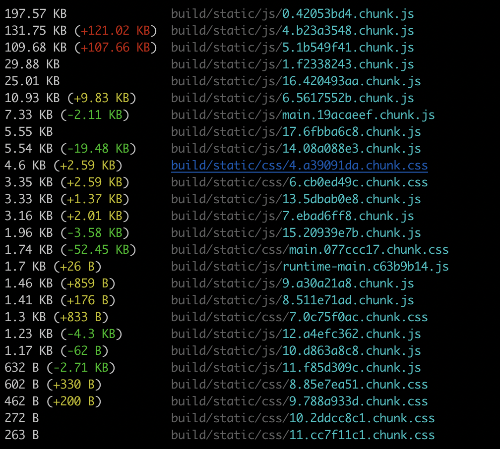

title: Web 缓存介绍
date: 2020-02-18 17:26:54
---

# Http缓存
总所周知，性能是一个网站是否成功的重要衡量因素，如果一个网页的加载速度超过了人的忍耐度，那么用户离放弃使用也就不远了。当然，系统性能是一个很深奥的话题，也很复杂，牵扯到太多的东西。不过，但是大多数情况下，我们可以通过专注于一些非常基本的应用程序交付技术来极大地改善应用程序的最终用户体验。Http缓存优化就是其中一道捷径。这篇博客文章介绍了如何设置 Http 缓存，实现系统的通讯优化。

# 客户端缓存
由于现在 Web 采用的是 C/S 模型，所以在服务器进行资源更新之后是无法主动通知到客户端的，也无法主动推送，所以为了实现传输的最优化，一些静态资源是很有必要缓存到本地，事实上，这也是 http 缓存最常见和有效的做法。

> 当然，随着 http2，websocket，pwa 等技术的兴起，在推送方面，能做的更好。

客户端缓存指的是客户端（通常是浏览器）第一次请求完成后把一些网页资源都保存在本地，那么在下一次请求的时候，如果符合缓存条件，就直接把本地的资源拿出来用。基本上，客户端缓存分为**验证型缓存**和**非验证型缓存**两种。

> 也有人把这两种缓存类型称之为**强缓存**和**弱缓存**，也有**强制缓存**和**相对缓存/协商缓存**之类的翻译。

## 非验证型缓存
也就是俗说的强缓存，就是如果页面发起这类的请求时，浏览器不会发送任何请求到服务器，而是直接从浏览器本地的缓存中直接拉起相应的数据，加载到页面中，由于没有对服务器的请求和传输，这类请求十分地快。想要开启非验证型缓存，只需要设置请求的返回头部即可。

有两个头部（header）可以控制这类缓存，分别是 **expires** 和 **cache-control**

### **Expires**
Expires 响应头包含日期/时间， 这个响应头是 Http1.0 的产物，控制缓存的具体方式为告诉浏览器过期的日期（GMT时间），即在此时候之后，响应过期。

无效的日期，比如 0, 代表着过去的日期，即该资源已经过期，让浏览器立即重新请求。

如果在Cache-Control响应头设置了 "max-age" 或者 "s-max-age" 指令，那么 Expires 头会被忽略，这个响应头在现在，基本上已经很少人用了，一方面是 expires 的缓存时间有时候并不准确，应该控制的时间受客户端设备的时间影响，如果客户端的时间设置出错，则缓存时间很难控制；另一方面 expires 的缓存表达能力有限，现在已经被 Cache-Control 取代了。

另外 expires 同时期还有另一个响应头 `Pragma`， 设置为 `no-cache` 代表禁用缓存，http1.1 的标准中已经废弃了，这个响应头更多用在兼容方面。

> [Mozilla Expires](https://developer.mozilla.org/zh-CN/docs/Web/HTTP/Headers/Expires)

### **Cache-Control**

`Cache-Control`是现在使用比较最为广泛的一个控制指令了，具体的语法和用法可以参考下方 Mozilla 的文档。

> [Mozilla Cache-Control](https://developer.mozilla.org/zh-CN/docs/Web/HTTP/Headers/Cache-Control)

## 验证型缓存
非验证型缓存的优先级要比缓存验证的优先级要高，如果非验证缓存失效了，那么浏览器就会去验证旧的缓存是否失效了，相当于准备开启第二层缓存。当然，这一过程在浏览器来说就是一次**缓存驱逐**

> **新鲜度**
> 理论上来讲，当一个资源被缓存存储后，该资源应该可以被永久存储在缓存中。由于缓存只有有限的空间用于存储资源副本，所以缓存会定期地将一些副本删除，这个过程叫做缓存驱逐。另一方面，当服务器上面的资源进行了更新，那么缓存中的对应资源也应该被更新，由于HTTP是C/S模式的协议，服务器更新一个资源时，不可能直接通知客户端更新缓存，所以双方必须为该资源约定一个过期时间，在该过期时间之前，该资源（缓存副本）就是新鲜的，当过了过期时间后，该资源（缓存副本）则变为陈旧的。驱逐算法用于将陈旧的资源（缓存副本）替换为新鲜的，注意，一个陈旧的资源（缓存副本）是不会直接被清除或忽略的，当客户端发起一个请求时，缓存检索到已有一个对应的陈旧资源（缓存副本），则缓存会先将此请求附加一个If-None-Match头，然后发给目标服务器，以此来检查该资源副本是否是依然还是算新鲜的，若服务器返回了 304 (Not Modified)（该响应不会有带有实体信息），则表示此资源副本是新鲜的，这样一来，可以节省一些带宽。若服务器通过 If-None-Match 或 If-Modified-Since判断后发现已过期，那么会带有该资源的实体内容返回。
> 
> [Mozilla 新鲜度](https://developer.mozilla.org/zh-CN/docs/Web/HTTP/Caching_FAQ#%E6%96%B0%E9%B2%9C%E5%BA%A6)

通过上面摘录的图片，我们可以看到，当验证缓存都没有或者失效的时候，并且之前有过缓存，服务器当时提供了 `Etag` 或者 `Last-Modified` 两个响应头，浏览器就会重新发送请求，并带上 `If-None-Match` 或者 `If-Modified-Since` 请求头来验证。

> 当然，如果是第一次请求或者没有任何验证器，浏览器也不会带上这些验证条件 :)

带上 `If-None-Match` 或者 `If-Modified-Since` 属于[Http条件请求](https://developer.mozilla.org/zh-CN/docs/Web/HTTP/Conditional_requests)，如果条件符合，服务器将会返回 304 (Not Modified) 响应，告诉浏览器不必下载内容了，资源内容没有发生变更，用之前缓存的就行。

下面来讲讲两个常用的验证缓存的请求头（验证器）:

### **If-None-Match**
> If-None-Match 是一个条件式请求首部。对于 GETGET 和 HEAD 请求方法来说，当且仅当服务器上没有任何资源的 ETag 属性值与这个首部中列出的相匹配的时候，服务器端会才返回所请求的资源，响应码为  200  。对于其他方法来说，当且仅当最终确认没有已存在的资源的  ETag 属性值与这个首部中所列出的相匹配的时候，才会对请求进行相应的处理。
>
> 对于  GET 和 HEAD 方法来说，当验证失败的时候，服务器端必须返回响应码 304 （Not Modified，未改变）。对于能够引发服务器状态改变的方法，则返回 412 （Precondition Failed，前置条件失败）。需要注意的是，服务器端在生成状态码为 304 的响应的时候，必须同时生成以下会存在于对应的 200 响应中的首部：Cache-Control、Content-Location、Date、ETag、Expires 和 Vary 。
>
> ETag 属性之间的比较采用的是弱比较算法，即两个文件除了每个比特都相同外，内容一致也可以认为是相同的。例如，如果两个页面仅仅在页脚的生成时间有所不同，就可以认为二者是相同的。
> 
> 当与  If-Modified-Since  一同使用的时候，If-None-Match 优先级更高（假如服务器支持的话）。
> 
> 以下是两个常见的应用场景：
>
> - 采用 GET 或 HEAD  方法，来更新拥有特定的ETag 属性值的缓存。
> - 采用其他方法，尤其是  PUT，将 If-None-Match used 的值设置为 * ，用来生成事先并不知道是否存在的文件，可以确保先前并没有进行过类似的上传操作，防止之前操作数据的丢失。这个问题属于更新丢失问题的一种。
> 
> [Mozilla If-None-Match](https://developer.mozilla.org/zh-CN/docs/Web/HTTP/Headers/If-None-Match)

### **If-Modified-Since**
>If-Modified-Since 是一个条件式请求首部，服务器只在所请求的资源在给定的日期时间之后对内容进行过修改的情况下才会将资源返回，状态码为 200  。如果请求的资源从那时起未经修改，那么返回一个不带有消息主体的  304  响应，而在 Last-Modified 首部中会带有上次修改时间。 不同于  If-Unmodified-Since, If-Modified-Since 只可以用在 GET 或 HEAD 请求中。
>
>当与 If-None-Match 一同出现时，它（If-Modified-Since）会被忽略掉，除非服务器不支持 If-None-Match。
>
>最常见的应用场景是来更新没有特定 ETag 标签的缓存实体。

> [Mozilla If-Modified-Since](https://developer.mozilla.org/zh-CN/docs/Web/HTTP/Headers/If-Modified-Since)

## 现在前端部署的一般做法

由于

> 更多地利用缓存资源，可以提高网站的性能和响应速度。为了优化缓存，过期时间设置得尽量长是一种很好的策略。对于定期或者频繁更新的资源，这么做是比较稳妥的，但是对于那些长期不更新的资源会有点问题。这些固定的资源在一定时间内受益于这种长期保持的缓存策略，但一旦要更新就会很困难。特指网页上引入的一些js/css文件，当它们变动时需要尽快更新线上资源。
> 
> web开发者发明了一种被 Steve Souders 称之为 revving 的技术[1] 。不频繁更新的文件会使用特定的命名方式：在URL后面（通常是文件名后面）会加上版本号。加上版本号后的资源就被视作一个完全新的独立的资源，同时拥有一年甚至更长的缓存过期时长。但是这么做也存在一个弊端，所有引用这个资源的地方都需要更新链接。web开发者们通常会采用自动化构建工具在实际工作中完成这些琐碎的工作。当低频更新的资源（js/css）变动了，只用在高频变动的资源文件（html）里做入口的改动。
> 
> 这种方法还有一个好处：同时更新两个缓存资源不会造成部分缓存先更新而引起新旧文件内容不一致。对于互相有依赖关系的css和js文件，避免这种不一致性是非常重要的。
> 
> [Mozilla 加速资源](https://developer.mozilla.org/zh-CN/docs/Web/HTTP/Caching_FAQ#%E5%8A%A0%E9%80%9F%E8%B5%84%E6%BA%90)

## Http2 

F5

## 服务器缓存怎么做

丢弃缓存

## 经验结论
1. 尽量使用 revving 技术，把一些静态资源文件在 url 上唯一化，视作独立的资源

# Service Worker 缓存
PWA 

# 参考
[Mozilla Caching_FAQ](https://developer.mozilla.org/zh-CN/docs/Web/HTTP/Caching_FAQ)
[Google HTTP 缓存](https://developers.google.com/web/fundamentals/performance/optimizing-content-efficiency/http-caching?hl=zh-cn)
[HTTP 缓存机制一二三](https://zhuanlan.zhihu.com/p/29750583)
[nginx-caching-guide](https://www.nginx.com/blog/nginx-caching-guide/)

浏览器的缓存有 2 种 一种叫验证性缓存，用 ETag 、 Last-Modified 、 If-None-Match 、 If-Modified-Since 来控制，其特点是会发一个请求给服务器来确认缓存是否有效，如果有效就返回 304 ，省去传输内容的时间 另一种叫非验证性缓存，或者有些人称为强缓存，用 Cache-Control 、 Expires 、 Pragma 来控制，其特点是一但有效就在有效期内不会发任何请求到服务器

从描述也能很容易看出来，非验证性缓存的优先级是高于验证性缓存的，因为有它在就根本不会发请求，自然也没有什么 If-None-Match 之类的东西出现的机会了 你看到的 200 from memory cache 就是非验证性缓存

那么为什么在 Chrome 下会有非验证性缓存呢？就是因为你没有设置 Cache-Control 这个头，没有这个头的话，其默认值是 Private ，在标准中也明确说了：

Unless specifically constrained by a cache-control directive, a caching system MAY always store a successful response

翻译一下：如果没有 Cache-Control 进行限制，缓存系统**可以**对一个成功的响应进行存储

很显然， Chrome 是遵守标准的，它在没有检查到 Cache-Control 的时候对响应做了非验证性缓存，所以你看到了 200 from memory cache 同时 Safari 也是遵守标准的，因为标准只说了**可以**进行存储，而非**应当**或者**必须**，所以 Safari 不进行缓存也是合理的

我们可以理解为，没有 Cache-Control 的情况下，缓存不缓存就看浏览器高兴，你也没什么好说的。那么你如今的需求是“明确不要非验证性缓存”，则从标准的角度来说，你**必须**指定相应的 Cache-Control 头