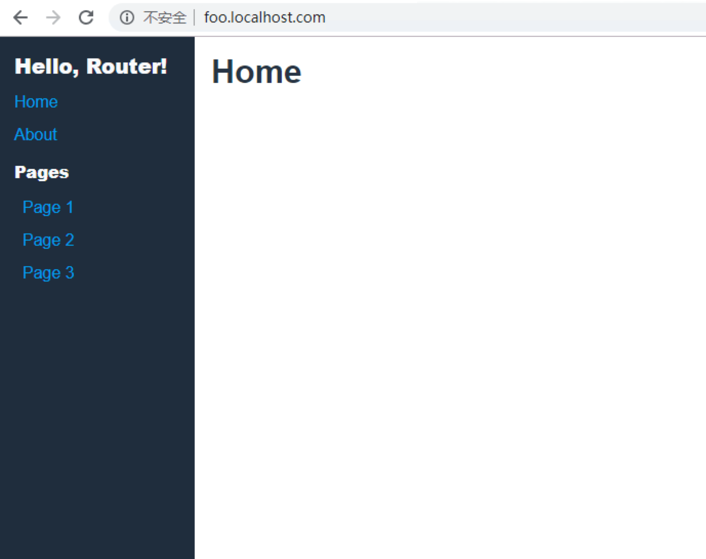
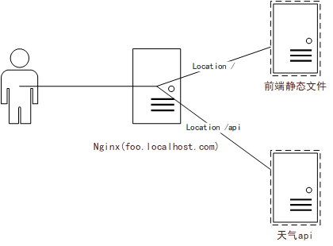
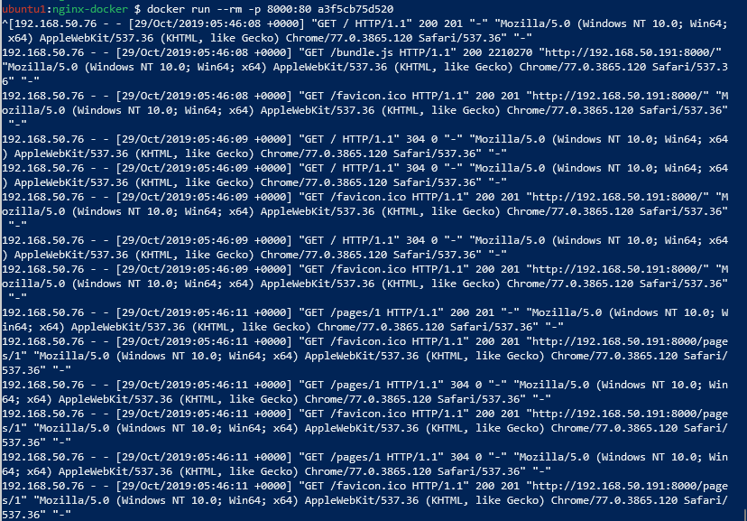

title: 前端NGINX使用攻略
date: 2020-02-22 12:16:07
---

#前端NGINX使用攻略

Nginx 是由俄罗斯人 Igor Sysoev 设计开发的一款免费开源的高性能 HTTP 代理服务器及反向代理服务器（Reverse Proxy）产品。发音发作 "engine x"。现在 NGINX 也有商业版本 NGINX PLUS，有高级负载均衡，JWT 解析等功能，其他基本和开源版本一致，这篇文章也是基于 NGINX 开源版本来构建例子。

现在的 web 应用，有很大一部分单页面应用是通过 Nginx 来部署的，这种部署让应用的前后端分离，更为灵活。

##NGINX部署静态页面


NGINX 的使用场景十分广泛，我们先用来部署一个简单的应用进行示范，我们用 [react-router-example](https://github.com/alanbsmith/react-router-example) 生成的 demo 作为本文的示范站点，这是一个有路由的单页面网站。

假设已经构建出来了一个 dist 的文件夹，我们要将它移动到 nginx 的默认目录下：

> 当然，你也可以移动到别的地方，甚至不移动。


```bash
sudo cp -r dist /var/www/foo
```

然后我们更改这个目录的 linux 用户所有者，以保证安全性。

```bash
sudo chown www-data:www-data /var/www/foo
```

 我们现在可以创建一个 nginx 的配置文件了，Nginx 可以很方便地配置多站点，我们假定绑定一个 foo.localhost.com 的域名给我们的服务器，那么我们新建一个路径为 `/etc/nginx/site-enabled/foo.conf` 的配置文件。

`site-enabled/foo.conf`
``` nginx
server {
    listen 80;
    server_name foo.localhost.com;

    root /var/www/foo;
    index index.html;
}
```
这应该是最为简单的一个配置。

我们 reload 一下 nginx 的配置。

```bash
nginx -s reload
```

这样，我们的 web 应用就部署好了，这个 Nginx 是部署在我一台 ip 为 `192.168.50.191` 的 Linux 虚拟机上的，我们需要绑定一下 `foo.localhost.com` 这个域名。

一般选择修改本机的 hosts 文件来绑定。

> 这里多说一嘴，如果是部署在互联网的应用，应该要在域名供应商上添加解析。

绑定成功后，就会通过 foo.localhost.com 访问到我们的页面。




### 处理单页面应用
<br/>
当然，这样的配置还有一个很大的问题，当你路由到 `http://foo.localhost.com/pages/1` 这个页面再刷新，或者直接进入到这个 url ，页面就 404 了。


这是因为现在的单页面应用普遍试用了 HTML5 的 [History API](https://developer.mozilla.org/en-US/docs/Web/API/History_API)，不久之前的 SPA （单页面应用）是用 Url 的 Hash 部分来实现的(井号)，在 HTML5 的 history api 出来后，监禁增强的 history api 便代替了 Hash 的使用，这意味着网站的 URL 从之前的 `foo.localhost.com/#page1` 变成了 `foo.localhost.com/page1`，`foo.localhost/page2`，这要求我们的页面访问这些页面都要返回同一份 HTML，也就是我们的单页面应用。

要完成这样的需求，Nginx 需要的配置也很简单，只需要把

``` nginx
index index.html;
```
换成
``` nginx
try_files $uri $uri/index.html /index.html;
```
即可（其实两行配置同时留着也可以）

```nginx
server {
    listen 80;
    server_name foo.localhost.com;

    root /var/www/foo;
    try_files $uri /index.html;
}
```


try_files 这个指令会让 nginx 按顺序查找文件，$uri 这个 URI 找不到的时候，就会返回 /index.html， 而 /index.html 是我们打包后的 应用 HTML 文件。


## 基本配置概念
看完了上面的简单例子，下面介绍一下 Nginx 的配置，Nginx 只需要知道两个配置概念就基本够用了，一个是指令（directive），一个是上下文（context）。

### 指令
Nginx 的配置指令包含名称和参数，例如最简单的

``` nginx
listen 80
```

一个配置文件绝大部分都是指令，上面这个指令是令一个服务上下文监听 80 端口来输出服务。

NGINX 的指令按照形式来区分，可以分为以下几种：

#### **普通指令**

在每个上下文仅有唯一值。而且，它只能在当前上下文中定义一次。子级上下文可以覆盖父级中的值，并且这个覆盖值只在当前的子级上下文中有效。
```nginx
gzip on;
gzip off; # 非法，不能在同一个上下文中指定同一普通指令2次
```

#### **数组指令**
在同一上下文中添加多条指令，将添加多个值，而不是完全覆盖。在子级上下文中定义指令将覆盖给父级上下文中的值。
```nginx
error_log /var/log/nginx/error.log;
error_log /var/log/nginx/error_notive.log notice;
error_log /var/log/nginx/error_debug.log debug;
```
数组指令
行动是改变事情的指令。根据模块的需要，它继承的行为可能会有所不同。

例如 rewrite 指令，只要是匹配的都会执行：
#### **行动指令**
```nginx
server {
  rewrite ^ /foobar;

  location /foobar {
    rewrite ^ /foo;
    rewrite ^ /bar;
  }
}
```
如果用户想尝试获取 /sample：

- server的rewrite将会执行，从 /sample rewrite 到 /foobar
- location /foobar 会被匹配
- location的第一个rewrite执行，从/foobar rewrite到/foo
- location的第二个rewrite执行，从/foo rewrite到/bar

> 指令不用记，一般写 nginx 配置文件都是从一份模版中修修改改得来的，所有的指令都可以在官方文档中找到，[http://nginx.org/en/docs/dirindex.html]()


### 上下文
上下文，你可以声明指令 - 类似于编程语言中的作用域
``` nginx
worker_processes 2; # 全局上下文指令

http {              # http 上下文
    gzip on;        # http 上下文中的指令

  server {          # server 上下文
    listen 80;      # server 上下文中的指令
  }
}
```


## 反向代理 api


反向代理是 Nginx 比较著名的应用场景，不过在这里不过多介绍，这里介绍一种页面部署场景。

假设我们已经部署好了一个页面 Nginx 应用，那么基本上这个 Nginx 就已经和一些后端服务程序脱离了，可以理解成现在常说的前后端分离，那么假设后端服务程序部署在了另外一个域名或者 ip 上，那么直接去请求这个程序暴露出来的 api 接口，是不被浏览器允许的，这是因为浏览器的跨域访问政策。当然，可以在后端服务程序的 api 接口上设置相应的 http 头部，就可以跨域请求。也可以通过 Nginx 的反向代理，来把后端 api 接口全部代理到 /api 这个路径上。

> tip：有时候反向代理 api 路径并不是一个好的选择，至于选择反向代理还是域名发散出一个 api 专用域名，取决与你的系统或架构。




下面我们来示范着配置一下

我们用一个免费的天气 api 作示范

[http://t.weather.sojson.com/api/weather/city/101030100](http://t.weather.sojson.com/api/weather/city/101030100)

``` nginx
server {
    listen 80;
    server_name foo.localhost.com;

    root /var/www/foo;
    try_files $uri $uri/index.html /index.html;

    location /api {
      proxy_pass http://t.weather.sojson.com/api/;
    }
}
```

重新加载配置后访问 [http://foo.localhost.com/api//weather/city/101030100](http://foo.localhost.com/api//weather/city/101030100) 就会返回正确的结果。
<br/>
请求通过我们的 Nginx 转发，从 `http://foo.localhost.com/api//weather/city/101030100` 转发到 `http://t.weather.sojson.com/api/weather/city/101030100` 并返回回来。
<br/>
这里需要注意的是 `/api` 如果写成 `/api/`，还有 `http://t.weather.sojson.com/api/` 后面的斜杠不写，是不会正确工作的，因为这些不同的 URI 会令 Nginx 进行不同的处理，情况比较复杂不在这里赘述。

## Docker 打包前端应用
Docker部署目前已经很流行了，Nginx 的 Docker 部署其实不难，这里顺便讲一下，就是把我们的配置文件和打包出来的资源拷贝进去制作一个 Docker 镜像即可。

下面是 Dockerfile
```Dockerfile
FROM nginx:1.16.0-alpine

COPY dist /var/www/foo

RUN rm /etc/nginx/conf.d/default.conf

COPY nginx.conf /etc/nginx/conf.d

EXPOSE 80

CMD ["nginx", "-g", "daemon off;"]
```
Dockerfile 里的构建命令做了几件事情，把打包出来的前端应用 dist 拷贝到 nginx-alpine 镜像里的 /var/www/foo，拷贝 nginx.conf 配置文件

这个配置文件就是上面我们的 nginx 配置文件，只不过我们不需要绑定 server_name 了，因为一般不会直接访问 Docker 的虚拟地址

```nginx
server {
    listen 80;

    root /var/www/foo;
    try_files $uri $uri/index.html /index.html;

    location /api {
      proxy_pass http://t.weather.sojson.com/api/;
    }
}
```

然后我们运行我们构建出来的 Docker 镜像，映射8000端口



在浏览器中访问，是可以正常访问的。

这里需要注意一点，Dockerfile 的最后一行，Docker镜像的 CMD 为 `nginx -g daemon off;`。这个比较重要，因为 nginx 的默认运行方式是 daemon（守护进程），nginx 是不会把日志打印到 tty 的，而 docker 的日志采集方式是通过 tty 来采集的，如果不关闭守护进程，我们将不能通过 docker 来看到 Nginx 的日志。

## Nginx 缓存
上面讲完了 Nginx 的基础配置，其实可以看到 Nginx 的配置其实非常简单，也就两三行就能搞定，不过一般我们在生产环境上要考虑的事情非常多，缓存是一个比较头疼的话题，这里来讲讲 Nginx 的缓存设置。

> 如果你对 web 缓存不太了解，那么可以先看看我的另一篇文章


## 性能调优及其他

### http2

### 长连接

### 连接数

### 缓存

### 连接粘连

### mimes

### 负载均衡

## 常用配置项介绍

## location

> http://nginx.org/en/docs/http/ngx_http_core_module.html#location

location 就是 nginx 配置中 URL 的匹配块，十分常用

语法为

```
location optional_modifier location_match {

    . . .

}
```

当然，这个指令别的就不多说了，其中最容易出问题的是 location 块的匹配项有冲突时，优先级的问题。

按照上面链接的官方文档，nginx 是先匹配前缀字符串（会匹配最长匹配的字符串，所以这时候跟配置文件书写顺序无关），再匹配正则表达式，如果找到正则表达式，则马上进行覆盖（如果按照配置文件书写顺序找到并命中了正则表达式，则不会往下再寻找，这时候跟书写顺序有关。）

举个实际的错误例子：

``` nginx
location ~* \.(?:css|js|png|jpg|svg|woff2)$ {
    add_header       'Cache-Control' 'max-age=604800';
}

location /api/ {
    proxy_redirect     off;
    proxy_pass         http://xx_upstream/;
}
```
如果用了上面的配置，如果访问 DELETE /api/image/xxx.png 时，由于正则表达式会覆盖前端字符串的 location，也就是说这个请求不会转发到 xx_upstream。

解决的方案是使用 `^~` 修饰符，用来打断寻找正则表达式。

``` nginx
location ^~ /api/ {
    proxy_redirect     off;
    proxy_pass         http://xx_upstream/;
}
```

这里顺便把官方文档的例子给搬出来，如果是 `location /` 的匹配，并没有 location 等情况时，可以使用 `location = /` 来加速，因为这样的配置跳过了继续寻找正则表达式的 location。


### proxy_redirect
> https://nginx.org/en/docs/http/ngx_http_proxy_module.html#proxy_redirect
用作于重写 Header 中 `Location` 或 `Refresh` 的信息。
如果代理后的 header 中 `Location: http://localhost:8000/two/some/uri/` ，而 nginx 配置为 

``` nginx
proxy_redirect http://localhost:8000/two/ http://frontend/one/;
```

最后返回的 Location 则被重写为 `Location: http://frontend/one/some/uri/`

不过常用的做法是设置 `proxy_redirect off`， 令 Location 的地址跟客户端访问 nginx 的地址一致，因为如果配置了 `proxy_pass`， `proxy_redirect` 不设置的话，默认为 `proxy_redirect default`，这样会自动修改 Location 为 proxy_pass 的地址

## 参考
- [https://zhuanlan.zhihu.com/p/33492951](https://zhuanlan.zhihu.com/p/33492951)
- [https://sdk.cn/news/8067](https://sdk.cn/news/8067)
- [https://zhuanlan.zhihu.com/p/65393365](https://zhuanlan.zhihu.com/p/65393365)
- [http://aosabook.org/en/nginx.html](http://aosabook.org/en/nginx.html)