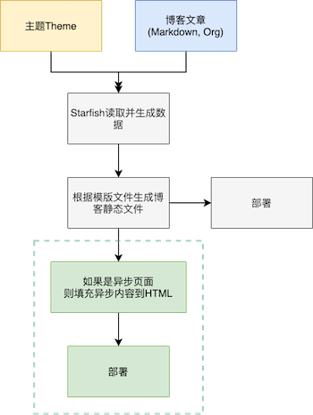
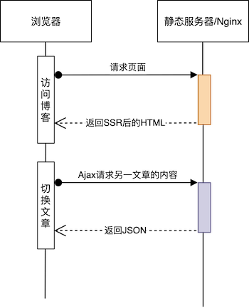
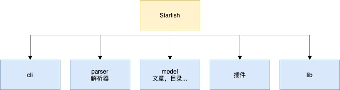
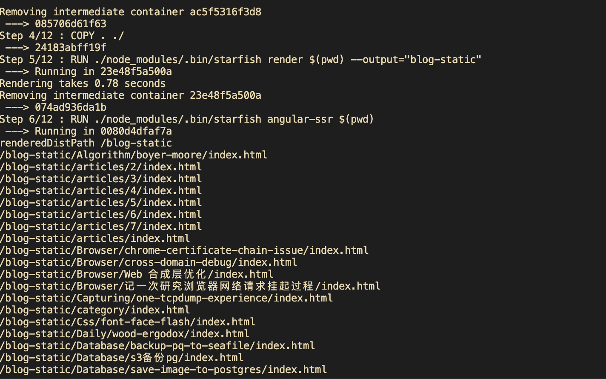

title: 我是怎么构建静态博客网站的
date: 2021-02-20 09:26:54
---

我的博客 https://www.chencanhao.com 是自己撸了一个轮子构建的，是一个类似 HEXO 的一个构建程序，将 markdown 和 org-mode 的文章渲染成 HTML 文件，并构建成一个静态站点，部署到服务器，形成个人博客。

这是构建程序 **Starfish** 的代码仓库 [https://github.com/fwchen/starfish.git](https://github.com/fwchen/starfish.git)

其实当初为什么想要自己写一个构建工具呢？其实当时看到 HEXO 的主题并没有自己喜欢的，而又不太喜欢当时 HEXO 主题的写法， 加上 HEXO 有些配置也并没有我想要配置的项，本着练手的想法，还是撸了一个轮子。当然，撸了这个轮子之后，才发现，包括一些 SEO 的问题，其实构建一个可用的博客站点，要考虑的因素还是又很多的。所以写这篇博客来供大家参考。

首先是构建博客制品的流程，见下图



首先是解析 Markdown 和 Org-mode 的文章，将其解析成 HTML 的形式，然后加上各种其他数据，例如编写时间，题目，所属目录等，然后根据配置的目录结构将这些信息通过模版的形式渲染到主题的HTML模板上，这一点上参考了 HEXO 的做法，文章页会使用 article.html 的模版渲染，归档页会使用 archive.html 的模版渲染。

最后，再根据主题配置，复制相应的资源，例如图片，robots.txt之类的资源，构建成完整的站点资源。
 
这是最简单的做法，在我的一个主题 [starfish-theme-hg](https://github.com/starfish-organization/starfish-theme-hg)，使用的是 Angular 构建的单页站点，那为什么要构建一个单页站点来当博客呢？首先，使用 Angular 能使得开发主题更有趣，这个流行的前端框架有许多有趣实用的特性，而且资源并算大，功能实用不多的情况编译出来的大小跟 JQuery 无差，甚至会更小；其二，单页应用在切换的时候，并不用刷新页面，能做出流畅的动画，速度也很快，这会带来很好的体验。

但是随之的问题也来了，Angular 构建出来的单页应用没法做 SEO，因为搜索引擎不会去获取异步 ajax 加载的内容，所以，就必须做异步预渲染，像 SSR（Server Side Render），当然 Angular 叫 Universal，其实都是一个意思，这个概念没出来也有叫 Pjax 的，所以在上图的虚线框里，如果主题是异步加载的主题，Starfish 还可以做一次“SSR”，是在本地把所有的博客链接都通过 Angular 的 Universal 渲染一遍，再保存起来，形成博客静态文件目录，当浏览器请求的时候，json 数据部分也同样请求静态服务器，如下图：



## Starfish架构
看看 **Starfish** 的代码结构，分为几个部分:



- CLI: **Starfish**的命令，如 `render`, `add`等
- Parser解释器： 解析 markdown, org-mode
- Model模型: 博文，目录，归档等概念抽象模型，用力解析和渲染
- Plugin插件: ssr渲染，钩子插件
- Lib: 库文件

## 如何使用&构建
使用 **Starfish** 建设博客的方法很简单，参考 [Github 仓库](https://github.com/fwchen/starfish.git) 的文档用书写博客，配置文件为 `config.yaml`，如下:

``` bash
├── articles
│   ├── Algorithm
│   │   └── boyer-moore.org
│   ├── Hardware
│   │   ├── build-home-nas
│   │   └── build-home-nas.md
├── config.yaml
├── Dockerfile
├── Jenkinsfile
├── nginx.conf
├── package.json
├── package-lock.json
├── README.md
└── @root-asset
    ├── aboutme.jpg
    ├── avatar.jpg
    ├── CNAME
    ├── favicon.ico
    ├── google7065849eb323b007.html
    └── robots.txt
```

然后即可使用 `starfish render [your blog path]` 来构建博客，默认的输出地址为 `blog-dist`。当然，使用 Docker 打包会比较方便：

``` Dockerfile
FROM node:12.20.2-alpine3.10 as build
COPY package.json package-lock.json ./
RUN npm install
COPY . ./
RUN ./node_modules/.bin/starfish render $(pwd) --output="blog-static"
RUN ./node_modules/.bin/starfish angular-ssr $(pwd)

FROM nginx:1.19.6-alpine
COPY nginx.conf /etc/nginx/conf.d/default.conf
RUN rm -rf /usr/share/nginx/html
COPY --from=build blog-static /usr/share/nginx/html
EXPOSE 80
CMD ["nginx", "-g", "daemon off;"]
```

输出如下:



然后启动镜像即可: `docker run -p 8080:80 [image ID]`

## 部署

最后其实是部署，下面是简单的 Nginx 的配置文件，因为 js 等静态文件都带上了哈希值，所以可以大胆使用强缓存

``` nginx
server {
    listen 80 default_server;
    listen [::]:80;

    root /usr/share/nginx/html;
    index index.html;

    location / {
        try_files     $uri   $uri/index.html =404;
    }

    location ~* \.(?:css|js|png|jpg|svg|woff2)$ {
        add_header       'Cache-Control' 'max-age=604800';
    }
}
```

最后，部署运行的博客站点不像在简书，掘金之类的平台，只要写了就有点流量，需要将博客登陆百度站长和谷歌站长，将网站收录进去，这样才能在百度搜索和谷歌搜索中被人搜索到，毕竟文章写了要被人看到才有意义，不然写来干嘛呢。这部分 SEO 工作也是比较耗费耐心和精力的，因为做 SEO 在搜索引擎上的反馈周期比较长。

Starfish 也支持生成 sitemap.txt 和 robots.txt，这两个文件会默认添加到构建目录下，搜素引擎会通过这两个文件来检索。

下面是百度资源平台和 Google Master 的地址，通过这两个官方的的文档，可以做相应的SEO。
- 百度资源平台: https://ziyuan.baidu.com/linksubmit/index
- Google Master: https://developers.google.com/search

除了需要结构化页面的结构化信息外，有质量的外链也能提高网站的权重，当然，Starfish 的主题已经做好了页面信息的结构性优化，对谷歌和百度的引擎是十分友好的，文章如果有独到内容的话，博客还是很容易被搜索引擎收录并展示的。
